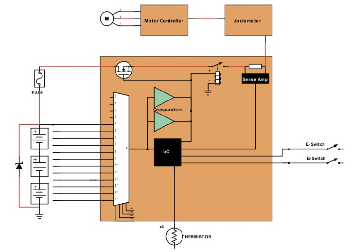
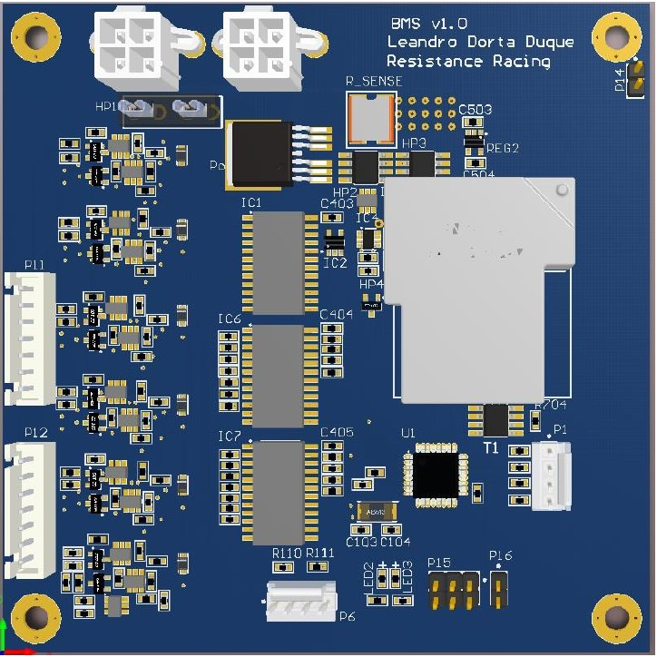
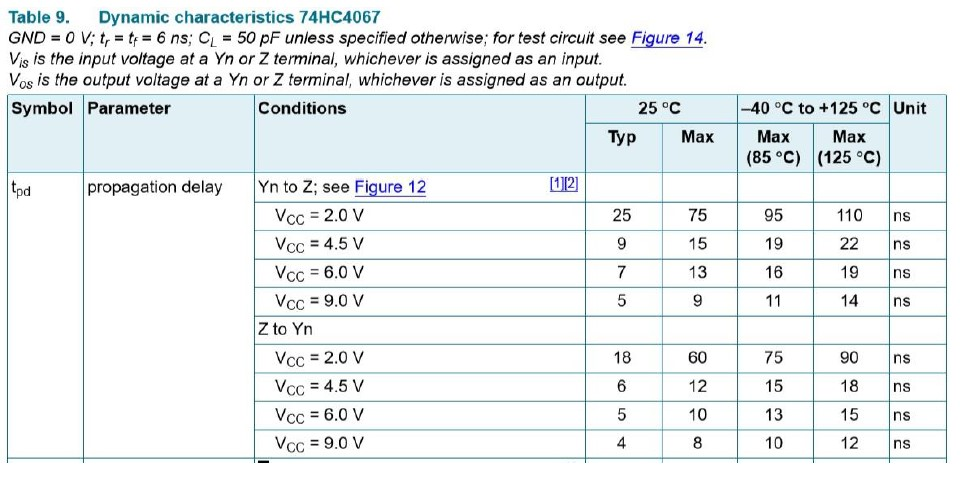

# BMS v2.0 

designed by Leo

+ [Summary](#Summary)  
    - [System Description](#system-description)  
    - [Terminology](#Terminology)  
+ [Technical Design](#Technical-Design)
    - [System Architecture](#system-architecture)
    - [Detailed Design](#detailed-design)
    - [Integration with Other Systems](#integration-with-other-systems)
+ [Design Process Reflection](#design-process-reflection)
    - [Design Considerations](#design-considerations)
    - [Timeline](#Timeline)
    - [Collaboration](#Collaboration)
+ [Conclusion](#Conclusion)
    - [Technical](#Technical)
    - [Process](#Process)

## Summary

### System Description 

The Battery Management System consists of an electrical circuit that has as main functionality to monitor the state of a battery pack. This is achieved through the constant measuring of a variety of parameters such as battery cell voltage, current, temperature, state of charge, etc. The use of a Battery Management System for our team is required since we are competing in Shell Eco-Marathon in the category of Prototype in the division of Electric Vehicle, which means that the main source of power for our vehicle comes from a battery pack. The type of battery established by the competition’s rules is Lithium Polymer, which can be very dangerous if operating unsafely. This is why it is absolutely necessary to use a BMS when manipulating this kind of batteries.

As it was described in FA_18_TechnicalReport_Electrical_BMS (which I recommend reading before going through this one), the design of this BMS is completely custom and different from last year’s, which makes the design process more challenging and time consuming. By the time this report is being written, unfortunately this design could not be ready for the competition, but it has the potential to be reused and finished for next year. All the explanations of how we came up with the design and the thought process is included in the FALL Technical Report. As it was mentioned there, there is no much literature about completely custom battery management systems online. In general, the way to go is to buy a BMS IC, which is an application specific integrated circuit (ASIC) that does all the job and you only need to make it communicate with a microcontroller to process the data and make the decisions accordingly. In this design, we were basically creating everything from scratch, getting rid of the BMS IC and building all the necessary circuitry to achieve the main functionalities required for the BMS.

### Terminology

IC: Integrated Circuit. A device designed for mounting on a PCB or in a breadboard, usually in a small black package, which performs some specific functionality (opamp, microcontroller)

PCB: Printed Circuit Board. A board of copper and fiberglass used for wiring small IC’s and passives in a compact manner.

Cell/Battery: Battery refers to the battery pack of 12 battery cells

Passive Device: electric device with linear IV relationship: resistor, capacitor, inductor.

Joulemeter: Device which measures current and voltage to determine the amount of instantaneous power consumption.

MC: Motor Controller. Delivers signals to the motor to control when and how fast it accelerates the vehicle. We are using a brushless DC motor and therefore a BLDC motor controller.

BMS: Battery Management System

DAQ: Data Acquisition System. Collects data and will provide visualization and analysis.

Microcontroller (μC): Small computer integrated in an integrated circuit. It includes the processor and also peripherals.

I2C: Serial communication protocol that consists in two main lines: clock and data signals. It accepts multiple masters and multiple slaves.

SPI: 4-wire serial communication protocol. It accepts both single- and multi-masters with multiple slaves. It includes CLK (clock), MISO (master in slave out), MOSI (master out slave in) and CS (control signal).

DC-DC Converter: Electronic device used to step down the voltage from 48 V to either 3.3 or 5 V.

## Technical Design 

### System Architecture 

The main functionalities of the Battery Management System are the following:
- Measurement of voltage of battery cells (to detect under or over voltage)
- Measurement of current (to detect overcurrent)
- Measurement of temperature (to detect overheating)
- Isolation of the battery pack from the electrical system of the vehicle in case the system is operating unsafely, or it was switched off (by external emergency switches)
- Communication of all the data to DAQ
From these main functionalities, we can also derive important parameters such as power consumption (P = I * V), state of charge of the battery, among others.
Again, all the main details are included in FA_18_TechnicalReport_Electrical_BMS, but this is the high-level design of the BMS.

As it can be seen, the BMS has two types of connections with the battery pack: high power (red) and low power (black) connections. The high-power connection corresponds to the connection with the top cell of the battery pack where the voltage is maximum (48 V) since, in our case, they are connected in series (12 cells of ~4.25 V max). The high-power connection passes through a series of fuse and power transistor which are devices used for protection: a fuse, power transistor, and relay. The fuse is a tiny a fragile wire where the current passes through and that is rated to certain amount of current, so it guarantees that the circuit does not go above the specific value that it is rated for; in the case it does, the fuse breaks itself, leaving the connection open. The second protective element is the power transistor which operates as a switch; it will be used to isolate the battery pack from the rest of the electrical system in case of an emergency (basically when the system is operating out of the safe region). In order to turn this “switch” on and off, you must pass certain amount of voltage to its gate (which must be higher than its threshold voltage, specific for the type of transistor (ECE 3150)). This operation is taken care by a power transistor driver. Another protective element is the relay, which is an electromechanical switch. The main idea is that it controls a high-power connection using a low power connection and electromagnetism. The low power connection has a coil (identical to an inductor) that when electrified produces a magnetic field. This magnetic field attracts (or repel, depending if the relay is Normally Open or Normally Closed) a piece of metal that serves as bridge for the high-power connection. The relay (which is required by Shell) guarantees physical isolation of the battery pack and the electrical system, so the only electrical device physically connected to the battery pack is precisely the BMS.

Other element in the high-power connection is a current sense resistor connected to a current sense amplifier. This is the system to read the level of electrical current our system is drawing. The details of how it works and why we made the design decision of doing it this way are included in FA_18_TechnicalReport_Electrical_BMS. From this point, the high-power connection continues to the joulemeter, motor controller and finally the motor.

In terms of low-power connections, we have the connection with each battery cell in order to measure the individual voltages. Lithium Polymer batteries operate safely in the region of 2.5 to 4.2 V approximately (battery cells), so our system must measure these individual voltages and take action in the case the measured voltage is out of this range. These connections are not made directly to the microcontroller (where all the data is processed) because, as the connection between battery cells is in series, the voltage read will correspond to the addition of the voltages of all cells under the one you are measuring from. The microcontroller’s pins are not rated for such amount of voltage (depending on the microcontroller, they are rated to 3.3 or 5 V in most cases). Therefore, an external circuitry is required to massage these signals before they make it to the microcontroller. Again, the explanations for this are included in the previous technical reflection. Other elements included as low-power connections are the thermistors to measure temperature and emergency switches to mechanically turn the vehicle off.  

### Detailed Design 

The printed circuit board for the BMS was finally fabricated which included all different subsystems previously described. It is a four-layered board, and the decision to make it like that was based on the level of difficulty to make every on-board connection using only two layers and keeping the standard size that we had agreed on for the PCB (10 x 10 cm). The following image shows the PCB.

The final board had two main issues:

- It does not include an external switch to reset the system, which is not desirable. Every time you are designing a system that includes a microcontroller, make a physical connection to the reset pin (basically, includes an external switch). It is important to exploit the reset functionality to initiate the program and also for debugging purposes.
- It misses the connection to turn the PMOS for each cell on so every capacitor can charge simultaneously. This is a critical functionality to measure the cell voltages. The solution for it was to make an external connection (solder a wire).

Since the explanation of how every system works is in the previous report, I will here describe the main idea of how we expect the circuitry to measure the cell voltages to work and what are the main considerations. Also, how the system in terms of software could be structured. By the time this report was written, we had code for individual parts that needed to be fully tested and were missing the integration of the whole code.

The main idea to read the voltage from each cell (again, detailed description in the previous report) is based on the idea of transferring the voltage to a capacitor in parallel with the battery cell, then each capacitor is connected to a multiplexer, which is basically a device that receives the 12 connections (one per cell) and selects which signal will go through. Once the signal passes the multiplexer, it splits in three: two connections to comparators to check for the voltage limits and one that goes to a buffer, which is basically a device that lowers its output impedance in order to preserve the integrity of the signal. In our case, it is necessary because that connection goes after to an ADC which as an input impedance low. The ADC has 10-bit resolution, which means that the values of voltage range from 0 to 1024. The ADC is internal to the microcontroller. The outputs of the comparators go to a 3-input AND gate along with a signal that indicates if the power transistor should turn ON or OFF.

The main challenges arise when trying to synchronize everything to achieve the cell voltage reading. There are several signals that must be synchronized with respect to each other. The entire operation should be described as follows: first, the signal that turns all PMOS on should be on for enough amount of time to charge the capacitors with the voltage of each cell respectively (this amount of time will be measured in terms of time constant which is equal to R*C, it is recommendable to use at least 3 time constants to make sure they are completely charged). Once the capacitors are charged, the PMOS should be turned off, and later the NMOS should be turned on in order to measure the voltage level of each capacitor. Now, we must make sure that there is no overlap, which means that both PMOS and NMOS are on because the read voltage is going to be huge because we are practically creating voltage pumps with the capacitors (that will destroy everything). Therefore, we must make sure there is an interval of time between these two signals.

In the case of the signals to turn the NMOS on, it will be specific for each battery cell, which will be determined by a DEMUX that splits the signal among the 12 cells. Both MUX and DEMUX share the same selector signals which indicate which cell we are reading from. Since we are using 16:1 multiplexers (MUX), the selectors are 4 (24 = 16). Therefore, those are the signals that must changed every time to read from each cell. There is another DEMUX that controls a crossing NMOS in each cell to completely discharge each capacitor. All this synchronization must be fast enough to avoid leakage from the capacitor (which means that the capacitor will be losing charge over time). We must take in consideration the physical components to determine the timing of the whole operation since it will depend on the characteristics of the electrical devices used in the circuit. For instance, we have already seen that to determine the time to charge a capacitor it will depend on the resistance and capacitance of the RC circuit. In the case of the amount of time to read a cell voltage successfully, we must guarantee that the signal has enough time to travel through that long path to the microcontroller as it was previously described. For this calculation, we need the propagation delay of every element in the path, which is the time that takes a signal to go through a device. The propagation delay for every component should be indicated in their respective datasheet. For instance, this is in the MUX datasheet:

You can see how they specify the different delays according to voltage level which is powering the device (5V in our case) and the direction of the signal since these MUXes are bidirectional (which makes them perfect to be used as DEMUXes too). We must take in consideration the propagation delay of all elements that the signal could encounter in the path.

Another element to consider when analyzing timing is the resistance and capacitance in the path. The way to derive this is called Elmore delay (ECE 4740) which is the representation of each component in the connection as a resistor and capacitor (according to how they are connected to the wire). This will take in consideration the impedance in the wire as well. We do not have to be very accurate on this (as a matter of fact, Elmore delay calculations are always way over the reality), but it is important to use this as an estimate of the minimum time that the microcontroller must wait to sample the correct signal. It sounds complicated, but it is just a matter of gathering all the information and calculating.

Another important point is that, in comparison to the design that was described in the previous report, we ended up using ATMega32 microcontroller, which is the same that Arduino Uno uses. This expands our possibilities in terms of code where we can use all Arduino libraries.

In the case of the current sensing system, the way to proceed is very simple: the sense amplifier detects the voltage across the sense resistor which is goes to an internal ADC in the microcontroller that converts it to a value in the range 0-1024. Having the voltage and knowing the resistance of the sense resistor, we can calculate the current using Ohm’s law: V = I*R.

The procedure to measure temperature will be very similar. The thermistors are used in a voltage divider We connect the thermistors to an ADC channel to measure the voltage across it. Since the thermistor’s resistance varies with temperature, we will have voltage variations for different temperatures so that is the way to determine it. Now, we must see how the translation from temperature to voltage should be so we can have a reference. The easiest way I can think of is to empirically see how the voltage behaves with the temperature by collecting several values and plotting them. Then, we can have how the behavior is. From this graph, we can select critical points (such as inflection points) so we can use them as a reference. So, we create a lookup table with these values and use them to extrapolate others.

### Integration with Other Systems 

This is the way the BMS integrates with the rest of the electrical system.

As it was mentioned before, BMS is the only electrical device directly connected to the battery pack and it is the one that distributes the connection to the rest of the devices. This means that the BMS interfaces practically with all electrical devices. As it was previously described, the high-power connection goes from the BMS to the Joulemeter and from the Joulemeter to the Motor Controller and the Motor. The BMS is also connected to the DAQ (low-power connection) in order to transmit the data collected so it can be later updated in the database. The BMS also interfaces with emergency switches which will turn the relay off in the case of an emergency.

In reality, for a matter of bad time management, the BMS could not be fully tested interfacing with the rest of electrical devices when this report was written. However, we plan to test it before the end of the semester.

## Design Process Reflection 

### Design Considerations 

Design considerations I believe should be taken: time. You must be conscious of how much time you can dedicate to the project since this kind of project compromises several elements and takes a lot of time to complete it. Specially this new variant for the design of the battery management system, it took a lot of research and also simulations to come up with the design described here and also time to design the printed circuit board. Then, populating the board, finish the code and test everything takes much of the time and effort which brings to my mind another important consideration: teamwork. I believe that this project should be divided between two people. It will make the entire process easier and more productive. A logical way to divide the project is by having one person that works on the hardware design side and another in the software design side. However, I strongly encourage people to participate in both because it is a very enriching experience and also will facilitate the communication between team members.

### Timeline

Another important (critical) consideration is timeline. The way we have always divided the time for this kind of project is by dedicating the entire fall to design the board and then Spring for populating and testing. This kind of project, which involved a lot of research, couldn’t have been in another way; but if you are working on a well-known design, it should not take you the entire semester to finish the board. Also, to test the software part team members can create a prototype of the board using breadboards and Arduinos (if you decide to use the same microcontroller) and then start working on the code. I have had the impression that in several times and for several projects the Fall semester seems pretty chill and then the Spring semester is super stressful, specially when the competition starts a week before than expected.

### Collaboration

This stresses my point of having two people working alongside in this project. In this case, it was only one person working on it and it was very difficult to correctly manage the time to finish everything on time.

## Conclusion

### Technical

“Should the team change the system design or optimize the current system” is a really good question. From my point of view, there are two main options when it comes to the design of Battery Management Systems: you either use a BMS IC (ASIC) and build the circuit around it or you design all the circuitry from scratch getting rid of the IC and using only the microcontroller. If you decide for the first one, you must completely understand how the IC works and going through the extensive datasheet of it. This shouldn’t take you too long so you can start designing the board so you can have enough time to test everything, specially the communication between the BMS IC and the microcontroller. That is the most critical part because your BMS IC will be working fine but if the communication is faulty, your data is useless. If you decide that you want to create something from scratch, let me tell you that it is the most exciting experience but also the most challenging one. There is almost none documentation online about open source BMS which makes the process very difficult. Also, since you are creating something that nobody has done before, you have to make sure that it logically works through tons of simulations and after fabricating the board make a lot of testing.

I truly believe in this design. I have conducted tons of simulations and, even though when writing this paper, it hasn’t been fully tested, I plan to do it before the semester ends so the information will be available. If this design works, it could become one of a few open-source BMS that exist which gathers a lot of prestige and could also compete in the Shell Eco-Marathon in the category of innovation. So, I am biased; I would say you should work on this design, but you have the two options.

### Process

The design process that I follow is the logical one for this kind of projects. The only thing that I highlight is the necessity of having more than one person to work in such a project, not because one person is not capable of doing it but because it will make the time managing easier and more effective.