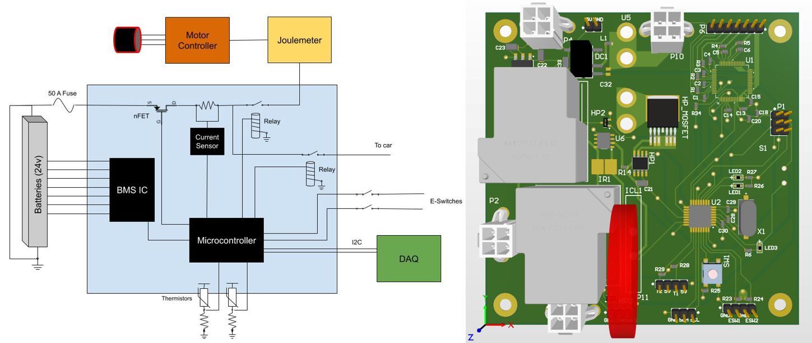
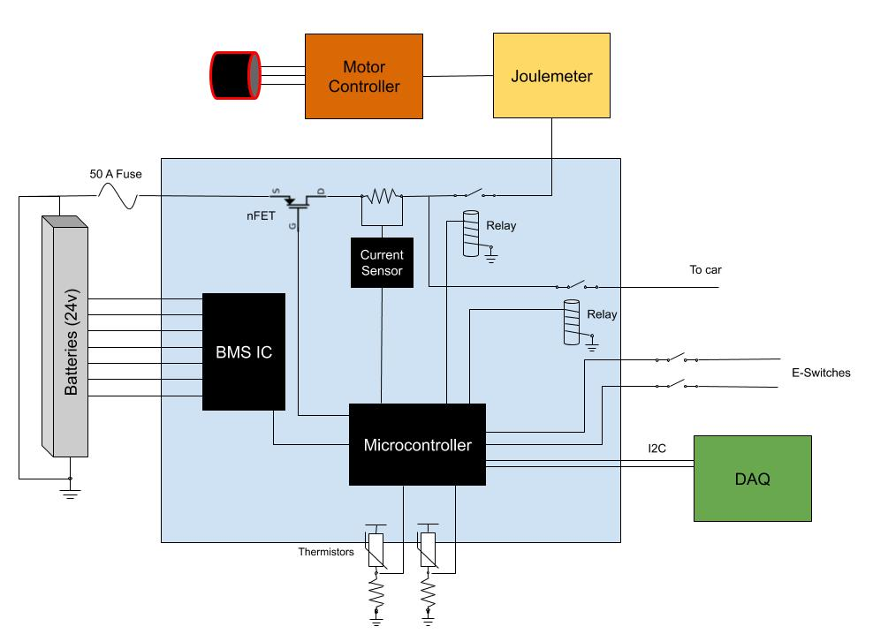
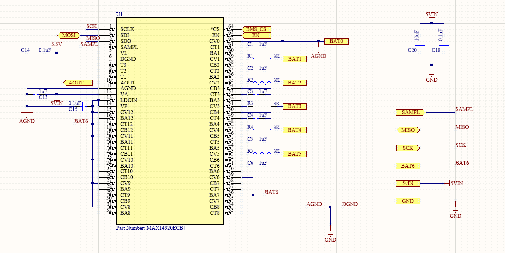
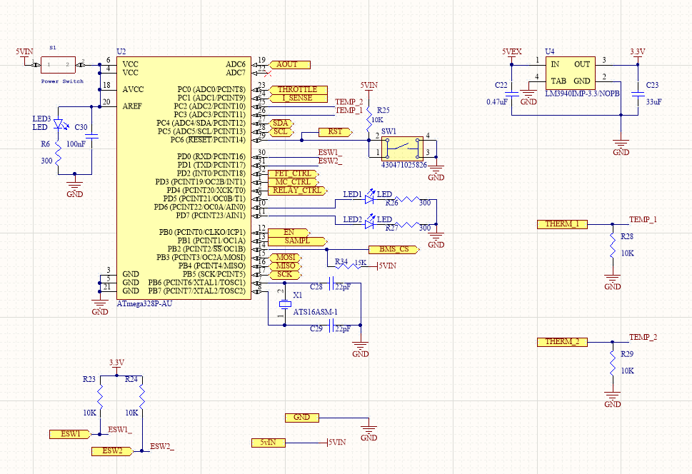
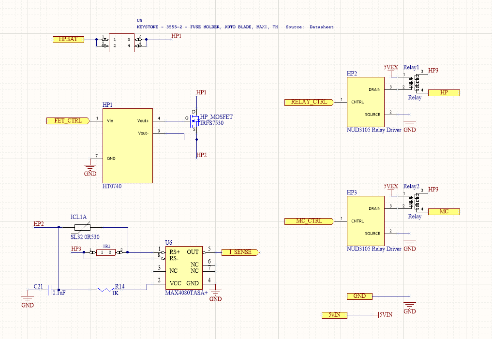
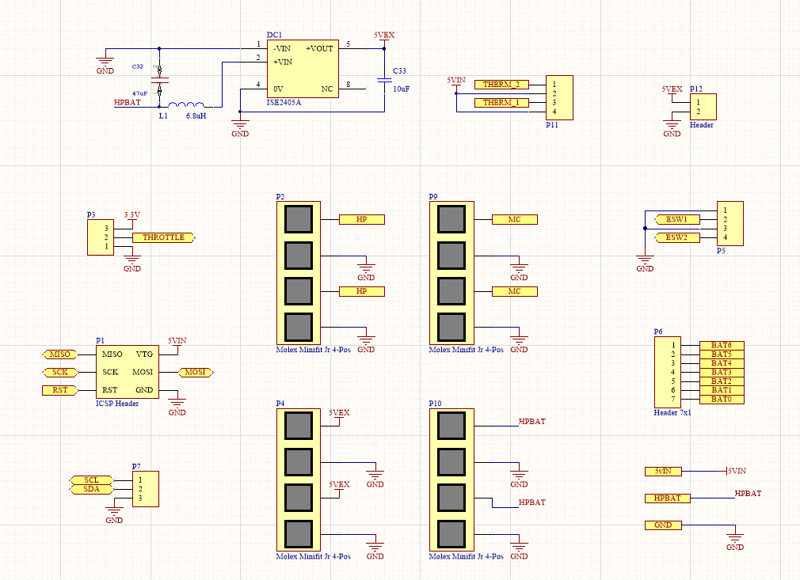
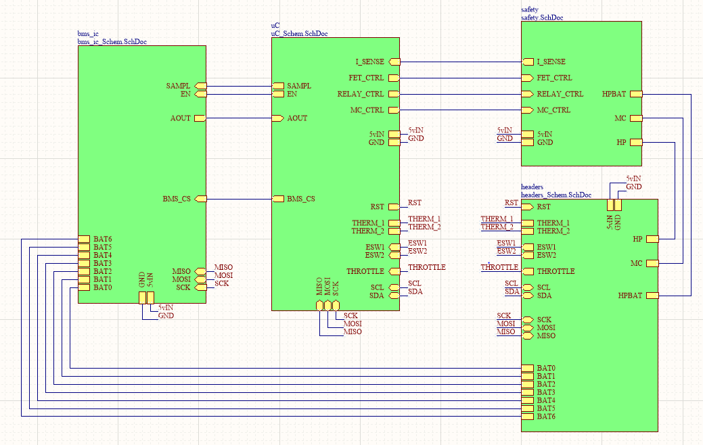
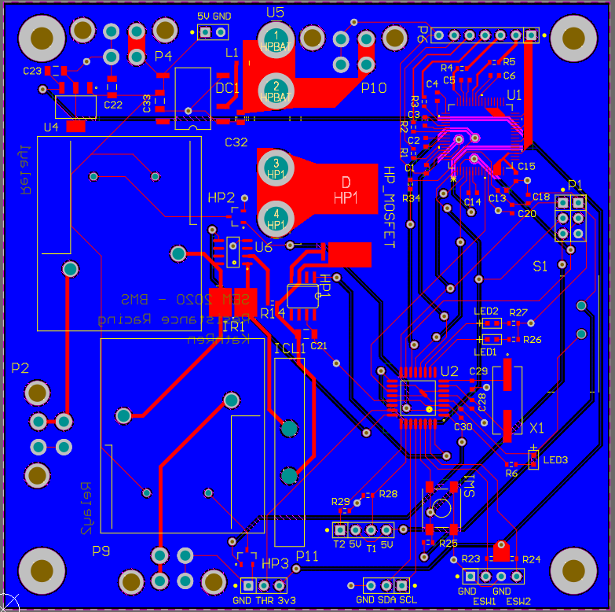
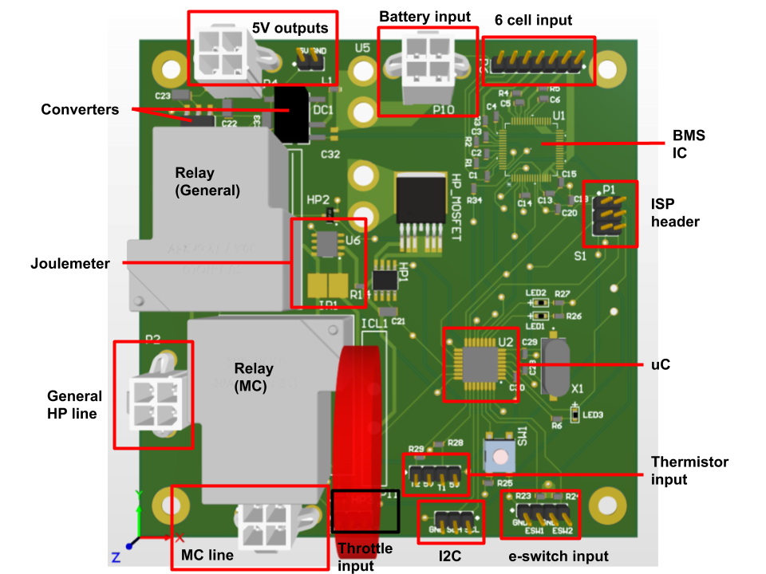
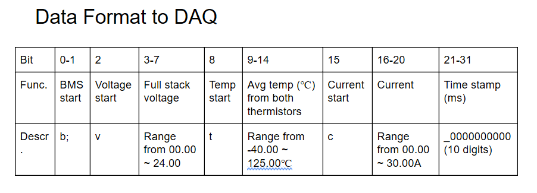

# Battery Management System Fall 2019 Technical Report
by Kathleen Wang, Lauren Shen

[Project Repository](https://github.coecis.cornell.edu/Resistance-Racing/BMS19_20)

+ [Summary](#Summary)
  - [System Description](#system-description)
  - [Terminology](#Terminology)
+ [Research and Requirements](#research-requirements)
  - [Background Research](#background-research)
  - [Design Requirements](#design-requirements)
  - [Design Requirements Derived from Rules](#design-requirements-from-rules)
  - [Key Parameters](#key-parameters)
  - [System Diagram](#system-diagram)
  - [Potential Designs](#potential-designs)
  -[Selected Design and Justification](#selected-design-justification)
+ [Detailed Design (Schematic & Layout)](#detailed-design)
  - [Design Overview](#design-overview)
  - [Component Selection](#component-selection)
  - [Mounting and Packaging](#mounting-packaging)
+ [Analysis](#analysis)
  - [Hand Calculations](#hand-calculations)
+ [Bill of Materials](#BOM)
+ [Manufacturing/Testing Plan](#manufacturing-plan)
+ [Project Reflection and Future Work](#project-reflection)
+ [References](#references)
## Summary
### System Description 
The battery management system is an electrical circuit whose main functionality is to monitor the state of the battery pack and be able to provide isolation of the battery from the entire vehicle system in the case of unsafe conditions. It is required according to the rules for the Shell-Eco Marathon to monitor our 24V, 6-cell LiPo battery.  

In particular, we are using a battery monitor IC which is able to sample voltages from the individual cells (converted using the microcontroller's internal ADC), a current sense amplifier to measure current, and thermistors to measure battery temperature. All data is sent to a microcontroller that communicates this information to the DAQ. The microcontroller also monitors these values in relation to specifications (derived from the battery datasheet), as well as the state of the E-switches, to determine actions to take in the safety path (MOSFET, relays). Another aspect of our system is the ability to cut power to the motor controller based on its throttle value, which can increase efficiency. 

## Research and Requirements   
### Background Research   
- Datasheet for the battery monitor IC (MAX14920): https://datasheets.maximintegrated.com/en/ds/MAX14920-MAX14921.pdf
- Datasheet for Current Sense Amplifier (MAX4080): https://datasheets.maximintegrated.com/en/ds/MAX4080-MAX4081.pdf
- Datasheet for uC (ATMega328p): http://ww1.microchip.com/downloads/en/DeviceDoc/Atmel-7810-Automotive-Microcontrollers-ATmega328P_Datasheet.pdf

- Introduction to SPI (communication protocol): https://learn.sparkfun.com/tutorials/serial-peripheral-interface-spi/all
- Introduction to I2C (communication protocol): https://learn.sparkfun.com/tutorials/i2c/all

Additionally, technical reports from 2019, 2018, etc. can be read in order to see how the BMS has attempted to be implemented previously.  

### Key Parameters   
- Nominal voltage: 22.2V  
- Individual cell voltage range: 3.7V (25%) - 4.2V (100%)  
- Current limit: 50A  
- Temperature limit: -20 ~ 60 C
Battery parameters were taken directly from the datasheet. We determined the current limit by considering all the possible current draws from all electrical and software systems. 

Battery: https://www.amazon.com/Turnigy-High-Capacity-10000mAh-Multi-Rotor/dp/B07MSGP8JZ/ref=sxbs_sxwds-stvp?crid=T3R9LZOT9N8M&keywords=22.2v%20lipo%20battery&pd_rd_i=B07MSGP8JZ&pd_rd_r=9465fd81-f030-4877-8016-ac903a60802d&pd_rd_w=iUMDn&pd_rd_wg=6M1S1&pf_rd_p=a6d018ad-f20b-46c9-8920-433972c7d9b7&pf_rd_r=MRHAXEGB4B2D3C4N5RQR&qid=1571957893&sprefix=22.2v%20lipo%20,aps,146 

### System Diagram   
  

### Potential Designs   
- Our primary plan (plan A) is to use a BMS IC called the MAX14920. The IC monitors up to 12 cells and supports under/overvoltage detection, thermal shutdown, short fault detection. Additionally, we have 2 thermistors in order to monitor the temperature, a current sense resistor/amplifier in order to measure the current, and safety circuitry (such as a fuse, power MOSFET, and 2 relays). To convert all analog inputs, the microcontroller uses its internal 10 bit ADC.

All the other plans involve approximately the same circuitry apart from how we are monitoring the voltage. Therefore, the plans detailed below talk exclusively about differences in how we would conduct voltage measurement.  

- Plan B would be to implement another BMS IC. For example, Logan used the BMS IC (TI bq76PL455-Q1) instead of the MAX14920 (however this can't be used now because of the voltage requirements). However, care should be taken in considering the pros and cons of each IC and how difficult programming it may be. Consideration should also be taken with respect to its compatibility with various microcontrollers and how easy it is for them to communicate. Additionally, IC’s can be hard to debug as inability to communicate with them results in the IC basically being a black box.   

- Another option that we considered for a while was the implementation last year (Plan C). This would involve custom BMS circuitry (no IC). The pros would be that it would be tailored to the number of cells we have and it would theoretically be clearer to debug. The cons are that there is no documentation and limited information on how this could be implemented, meaning there is a strong possibility that this may not work. Additionally, a reason you would prefer to use a BMS IC instead is because of size considerations (as an IC takes up significantly less room and would also probably cost less). It would be a very work-intensive but good learning experience, but all things considered, this would probably not be a good method to go with.
- Our last options if everything doesn't work would be to buy a BMS or use Logan's BMS from two years ago.

### Selected Design and Justification  
We chose to use Plan A after much deliberation. We were strongly considering Plan C for a while (up to PDR) since both Leo and Logan were very optimistic about using custom circuitry to avoid blackbox debugging issues, and thought the project would be an interesting analog design challenge. Since Leo had mentioned the difficulty of timing when sampling the capacitors in his design, we also looked into designs using differential op-amps and spoke to several professors about how we could go about creating a circuit. From these discussions, what they all suggested was that we just use an IC, which would generally be less difficult to debug. Upon hearing this, we started looking for other BMS IC’s, since the TI chip that Logan had used did not seem to work. Assuming that the IC works as specified, this will guarantee that the BMS will be correctly monitoring the cells, which would be very difficult to verify had we used custom circuitry. This is how we decided upon Plan A. 

## Detailed Design (Schematic & Layout) 

### Design Overview 

### BMS IC & Supporting Circuitry

- Our BMS IC, the MAX 14920 has sampling capacitors of 1uF, as specified on the datasheet. Each cell is connected to the IC through a 3k resistor, also as specified on the datasheet, with cells 7-12 connected to the top cell of our battery pack. We are using the 5V LDO on the BMS IC to exclusively power the IC and the MCU. The BMS IC is connected to the microcontroller via SPI and has a pullup resistor on the slave line. The cell voltage readings become available in the AOUT buffer, which is an analog input to our ATMega328. All bypass capacitors and resistors values were advised by the datasheet. 

The following information is related to programming the SPI communication between the BMS IC and the MCU. 

**Cell Reading (BMS IC)**

MAX14920 datasheet: https://datasheets.maximintegrated.com/en/ds/MAX14920-MAX14921.pdf 

Relevant signals
- SAMPL - voltages are tracked when SAMPL logic is high. When the signal falls, voltages are held internally and made ready for readout at the AOUT output.
- EN - drive EN low to put the device in shutdown mode and reset the SPI registers. Drive high for normal operation
- CS - active low

**Sampling**
- When sample and holding is controlled by SAMPL, set SMPLB to 0
- When sample and hold is controlled by SMPLB, keep SAMPL high

| SMPLB bit | SAMPL | Operation |
| ------ | ------- | -------- |
| 0 | LOW | Voltages held |
| 0 | HIGH | Capacitors charging (voltages tracked by sampling capacitor) |
| 1 | LOW | Voltages simultaneously sampled on capacitors, voltages held |
| 1 | HIGH | Voltages held |

If you want to read from each individual cell instead of just reading the full stack voltage, read about the holding phase.
**Holding phase** (reference Figure 5 in the datasheet):

- During the holding phase, each capacitor’s voltage can be independently routed to AOUT under SPI (start from highest cell to lowest)
- Select cell voltages with SC_cell bits, then set ECS = 1 and the selected cell’s voltage will appear at AOUT 
- Use ADC to convert the AOUT output  t_set after the rising edge of CS

**Reading Total Stack Voltage:**

- Set [ECS, SC0, SC1, SC2, SC3] = [0, 0, 0, 1, 1]
- Read during sample or hold phase

**SPI (24 bit interface - reference Figure 7 in the datasheet)**:
SDI (what the AtMEGA sends to the BMS IC)

| Name | CB1-CB16 | ECS | SC0-SC3 | SMPLB | DIAG | LOPW | 
| ------ | ------------ | ------------------ | ------------------ | -------- | ----------- | ------------ |
| Bit | 0-15 | 16 | 17-20 | 21 | 22 | 23 |
| Func | Balancing | Selection | Cell to select | Phase | Misc ops | Misc ops |
| Set | 0 or 1 | 0 = disable,1 = enable | ECS = 1:(Set [SC0, SC1, SC2, SC3] = (cell number - 1) in binary) where MSB = SC3, ECS=0 [0,0,1,1] - total stack voltage | 0 = sample phase if SAMPL is HIGH, 1 = hold phase | 0 = normal | 0 = normal |

SDO (what the BMS IC sends to the AtMEGA) - monitoring 

| Name | C1-C16 | OP0,1 | REV0,1 | UV_VA | UV_VP | RDY | OT |
| ------ | ------------ | ------------------ | ------------------ | -------- | ----------- | ------------ | --- |
| Bit | 0-15 | 16,17 | 18,19 | 20 | 21 | 22 | 23 |
| Func | Individual cell undervoltage condition | Product info | Die version | LDO output undervoltage cond.(5V) | Power supply undervoltage condition (24V) | Ready status | Thermal condition |
| Descript. | UV | [1,0] = MAX14920 | MAX14920 version bits |  |  | 1 = not ready to operate | 1 = thermal shutdown |

In particular, we want to check if bits 0-5, 21, or 23 are 1. If so, we want to cut powoer the the car. 

**Microcontroller & Supporting Circuitry**   

- We added the primitive circuitry for the microcontroller as specified on the datasheet, and used the minimal number of pins to fit our needs. Our microcontroller can be turned on/off by a switch, with an LED indicator. We have 2 additional LEDs available for testing and debugging. We also have a reset button, and external 16MHz crystal. The microcontroller uses SPI communication to communicate with the BMS IC, and I2C for communicating with the DAQ. The microcontroller takes analog inputs of the BMS IC's output, the motor’s throttle, the voltage across the current sense amplifier, and the two voltages from the thermistor dividers (after filtering). It also takes two digital inputs from the E-switches. As for outputs, the microcontroller sends signals to enable the BMS IC to sample, to drive the two relays, and to open/close the MOSFET. 

To calculate the temperature, we are using a simple voltage divider, whose top resistor is a thermistor. We know R25 and Vtherm, so we can calculate RT, the resistance of the thermistor, and use emperical data to figure out what temperature the resistance corresponds to. 
  

To calculate the current, we are using a current sense resistor and amplifier. The current sense has a very small resistor (and therefore because of V=IR, it has a very small voltage drop). We can then amplify this small voltage drop using a current sense amplifier (with a gain of either 5 or 20) and calculate from that the current through the system.   

**Safety Circuitry**  

- Our safety path features our top cell connection going through a 50A fuse and then through a power MOSFET (not used). We then measure the current by passing the line through a current sense amplifier. To eliminate inrush current, we have a 50A ICL before the current goes through a sense resistor. We are using the MAX4080 TASA amplifier which has a gain of 20. The high power line then splits into a general high power line, and a high power line just for the motor controller, each of which is controlled by a relay.

The relay is normally open and the relay driver is inverting. We drive the relay driver high to close the relay and drive it low to open the relay. This means that when the relay is high, it is open, and when it is low, it is closed. If either of the E-switches are high, you want to cut power to the car (open the relays). You can also check this logic by hearing the relays when they turn on and off / checking if the ports are shorted. 

The relays can cause a voltage drop. Therefore, we could not use the LDO from the BMS IC to power them, and resorted to using the converter on the board. Consider using a resilient 5V supply to drive the relays. 

**Headers**  

- We have 4 Molex connectors that are used to deliver power to other subsystems and also interface with the battery. In particular, these connectors are used to take in HP from the battery, deliver filtered HP to the other subsystems, deliver power to the motor controller, and deliver 5V to other subsystems. We also have a header to connect to each individual battery cell.  
Additionally, we have an ICSP header for programming the board, an I2C header for interfacing with the DAQ, and a header for the throttle input from the MC. Lastly, we have our headers for our thermistors and our E-switches. A 24V-5V DC-DC converter is also shown in this schematic sheet. 

Consider putting more descriptive names for the headers. Additionally, add more headers for the power lines for easier debugging. 

**Top Level**    

- This top level diagram shows all the connections between our schematic sheets. In particular it shows the connections (and communication protocols used) from the microcontroller to our other interfaces such as the BMS IC and safety circuitry. 

**Layout**    

- We followed all of the layout considerations found on the datasheets. We placed bypass capacitors as close as possible to all of the ICs, along with placing the sampling capacitors close to the BMS IC, and the crystal oscillator close to the microcontroller. We also tried to separate the SPI and I2C lines as far as possible to avoid noise. Due to overlapping, we ended up having to use a lot of vias so that we could connect lines on the ground layer. Our high power lines are either polygon pours, or extremely wide traces. For convenience, we placed all headers along the edges of the board. 

**3D View**    

- This is the 3D layout of the board. The largest/tallest components are the relays and the inrush current limiter. 

### Component Selection 
The most expensive components involved are the MAX14920 (BMS IC) at $9.18.  The BMS IC was necessary in order to be able to adequately monitor the individual battery cells and we chose to use the MAX14920 over other BMS IC’s due to the reviews we saw online. We also chose one for 12 cells since our original design was based on using a 48V battery. When we switched to 24V, we found that we could still use the same IC, so we did not change it. 
The ATMega328p was used since it is the same IC used on the Arduino Uno, which is open source; it also guarantees compatibility with the Arduino IDE, which we are familiar with. 
We decided not to use an external ADC, as suggested by the MAX14920 datasheet to simplify the SPI communication done on the end of the microcontroller. We also determined that the 10 bit ADC of the ATMega328 provided adequate resolution for our purposes.
The other components we used were necessary for the rest of the design. 

### Mounting and Packaging 
|Interface | Purpose |
| --- | ----------- |
| DAQ | BMS sends data (total stack voltage, current, and temperature) to the DAQ) and provides 5V |
| Motor Controller | When the throttle analog input from the MC is low enough, the BMS needs to cut power to the MC for efficiency |
| Bulkhead | Mounted on the bulkhead and must be located in the same package as the battery |

### Data Format 

## Analysis 

### Hand Calculations 
**Current Sense Amplifier** 

We had to perform some calculations for determining which current sense amplifier and resistors to use. The datasheet had a table with some example currents, but these did not fit our needs. We estimated that our top current would be around 30A, and want a max amplified Vsense of 5V. Given a gain of 20, 

 5 = 20(30Rsense)) → Rsense ≈ 8mΩ 

**Temperature Sensing** 

Steinhart-Hart Equation:

- 1/T (in K) = a + b *log(RT/R25) + c *log(RT/R25)^2 + d *log(RT/R25)^3 
  
- a = 3.3538111236e-03, b = 2.998583413e-04, c = 4.477412345e-06, d = 4.105990548e-08  

The constants a, b, c, d were determined from empirical data on the datasheet (pg. 31 of https://www.murata.com/~/media/webrenewal/support/library/catalog/products/thermistor/ntc/r44e.ashx?la=en-us) by solving a series of equations for our thermistor's parameters. We took points at -40, 15, 70, 125 °C. To convert from Kelvin to Celsius, we did C = K - 273.15.

In order to know how input from the adc value we received from the board, we used the following equation knowing that we had a 10-bit ADC for our MCU: 

- RT = 10k*(1023*adcval-1) (voltage divider bottom resistor is 10k)
  
- RT/R25 =(1023adcval-1) where R25 = 10kOhms

**Estimations**

We approximate the current draw from each system in order to have an estimate of what value to select for our current sense resistor and fuse. 
- Motor/MC: 0 - 20A  
- Jetson: 4.74A  
- Xavier: 3.42A
- Electrical Actuation: 1-2A
- BMS: minimal  
- DAQ/sensors: minimal  

Total: ~30A  

## Bill of Materials   
https://docs.google.com/spreadsheets/d/15F1QkPO6ktOI_wqq4PYELffnYGGmIFblJrkn0i938C4/edit?usp=sharing

## Manufacturing/Testing 
Before ordering the board, please do a thorough check (including having multiple people look over your design).
The BMS PCB and all the components we need should be ordered before we leave for winter break. This should ensure that when we return for JanFab, the boards should have arrived so we can get started right away with soldering and programming the board.  

Our current order of importance in testing is:
1. Safety circuitry (e-switches, power MOSFET) - this should be our first priority since it is concerned with safety and cutting power in case of conditions that are outside of our desired bounds. It is also tested during inspection at competition. 
2. Being able to cut power to the MC - this will help with the car’s efficiency.
3. Monitoring the individual cell voltages - this involves programming the MCU, ADC, and BMS IC. This might take a significant amount of time but is important since we want to know the voltages of the individual battery cells.
4. Current and temperature measurement - there is overlap with these and the other systems such as the DAQ and joulemeter. Additionally, we are not completely sure on what the current is, meaning that we will need to test with different resistor values. We may also potentially need to collect data on the the thermistor so that we can correlate resistances with temperature.

Since we couldn't use a serial monitor like if you used an Arduino, we did much of our debugging using LEDs and sending data over I2C to an Arduino (which acted as a sample DAQ). This way, for example, we could check our logic for the relays with the LEDs, as well as confirm our data format was correct. 

## Project Reflection and Future Work 
Our progress as of March 2020 was that the BMS passed e-switches and current sensing tests. Code was written for communication with the BMS IC over JanFab and briefly tested on the PCB with no fruitful results. This testing was cut short when we discovered problems with the schematic and were forced to hack our board. This process possibly fried the IC. Priority for the fall should be debugging the communication issues, but this would likely require ordering and populating a new board with the externally powered relay. 

Most of our early problems with the schematic and layout could have been solved with more review and testing beforehand. Try to test as many things on a breadboard as possible before formalizing them permanently on the board. The ATMEGA328 doesn't have the capacity to handle many processes running at the same time and offers you less freedom in programming (since you might be stuck only being able to use the libraries). You could consider switching to a more powerful MCU, and writing the code in C. 

When possible, follow the recommended designs in the datasheets as closely as possible. This can prevent issues that could easily be resolved by just going with what the manufacturer recommends. 

Additionally, please fact check everything that you will put on the board. This includes things that will come from previous iterations of the BMS. 

The battery management system is also preferably a project that should have at least one upperclassman working on it. Additionally, due to the amount of work required, it should probably be a project worked on by partners rather than an individual.   

## References 
**Datasheets**  
- Datasheet for the battery monitor IC (MAX14920): https://datasheets.maximintegrated.com/en/ds/MAX14920-MAX14921.pdf  
- Datasheet for Current Sense Amplifier (MAX4080): https://datasheets.maximintegrated.com/en/ds/MAX4080-MAX4081.pdf  
- Datasheet for uC (ATMega328p): http://ww1.microchip.com/downloads/en/DeviceDoc/Atmel-7810-Automotive-Microcontrollers-ATmega328P_Datasheet.pdf     
- Datasheet for DC DC 5V Converter (ISE2405A): https://www.xppower.com/Portals/0/pdfs/SF_ISE.pdf   
- Datasheet for 5V to 3.3V LDO (LM3940): http://www.ti.com/lit/ds/symlink/lm3940.pdf  
- Datasheet for MOSFET Gate Driver (HT0740): http://ww1.microchip.com/downloads/en/DeviceDoc/20005628A.pdf  
- Datasheet for MOSFET (IRFS7530): https://www.infineon.com/dgdl/irfs7530-7ppbf.pdf?fileId=5546d462533600a40153563a9d1e21d8  
- Datasheet for Relay (JTN1AS): https://www.digikey.com/products/en?keywords=255-2816-ND  
- Datasheet for Relay Drivers (NUD3105): https://www.mouser.com/datasheet/2/308/NUD3105-D-98386.pdf   
- Datasheet for 50A Fuse (0299050): https://www.littelfuse.com/~/media/automotive/datasheets/fuses/passenger-car-and-commercial-vehicle/blade-fuses/littelfuse_maxi_32v_datasheet.pdf; https://www.littelfuse.com/~/media/commercial-vehicle/catalogs/commercial-vehicle-fuse-fuseholder-guide.pdf  
- Datasheet for In-rush current limiter (SL320R530): https://www.ametherm.com/datasheetspdf/SL320R530.pdf  

